# Wirebarley Backend Engineer Coding Test - 지원자 서양훈

## 로컬 환경 실행 방법

#### Skill & Tools - Backend
- Java 17
- Spring boot 3.2.0
- Junit5
- JPA
- QueryDsl
- Spring Security - 인증 및 인가 처리시 사용
- Mybatis - Cursor Paging 구현 목적 사용
- JWT - 인증 및 인가 처리시 필요한 토큰 생성 그리고 검증시 사용
- Mysql 8.x
- H2 (TEST 코드 실행시에만 해당)
- docker

#### Server Execution
```
// 1. 해당 프로젝트 루트 디렉토리 까지 이동 합니다. 

// 2. `jar` 실행파일을 생성 합니다.
./gradlew bootJar

// 3. `wirebarley-service` docker image 를 생성 합니다.
docker build -t wirebarley-service .

// 4. docker-compose 를 실행 합니다. (mysql server -> wirebarley-service 순서로 실행 됩니다.)
docker-compose up -d
```
#### 실행이 안된다면 인텔리제이에서 지원하는 `bootJar` 명령어 이용해보기
#### `./gradlew bootJar` <-- 클릭!! 
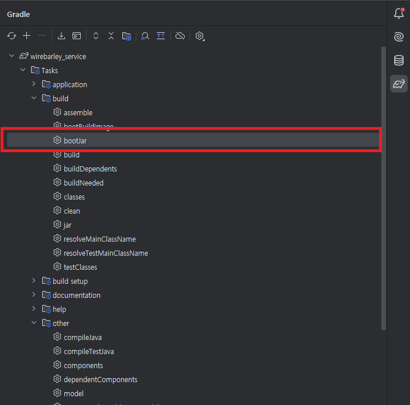


#### Service Endpoint
- Mysql
  - http://localhost:3306
  - id: root
  - password: 1234

#### API Reference

<details markdown="1">
<summary>자원 <-- <b>클릭하면 목록이 나타납니다!!</b> </summary>

<details markdown="1" style="margin-left:14px">
<summary>회원가입</summary>

**회원가입**
----
회원가입 합니다.

* **URL**

  http://localhost:8080/api/members/join

* **Method:**

  `POST`

* **Data Params**

  **Required:**

  `id=[String] - 아이디`  
  `password=[String] - 패스워드`  
  `name=[String] - 고객명`

* **예시**
```json
{
  "id": "test",
  "password": "1234",
  "name": "테스트"
}
```
</details>


<details markdown="1" style="margin-left:14px">
<summary>로그인</summary>

**로그인**
----
로그인 합니다.

* **URL**

  http://localhost:8080/api/authorize

* **Method:**

  `POST`

* **Data Params**

  **Required:**

  `id=[String] - 아이디`  
  `password=[String] - 패스워드`

* **예시**
```json
{
  "id": "test",
  "password": "1234"
}
```
</details>


<details markdown="1" style="margin-left:14px">
<summary>은행 목록 조회</summary>

**은행 목록 조회**
----
은행 목록 조회 합니다.

* **URL**

  http://localhost:8080/api/banks

* **Method:**

  `GET`

* **Header:**

`key: accessToken`
`value: ${accessToken}`

</details>


<details markdown="1" style="margin-left:14px">
<summary>은행 계좌 등록</summary>

**은행 계좌 등록**
----
은행 계좌 등록 합니다.

* **URL**

  http://localhost:8080/api/bank-accounts/banks/{bankNo}

* **Method:**

  `POST`

* **Header:**

`key: accessToken`
`value: ${accessToken}`

* **Data Params**

  **Required:**

  `bankName=[String] - 은행명`  
  `bankAccountNumber=[Integer] - 계좌번호`

* **예시**
```json
{
  "bankName": "우리은행",
  "bankAccountNumber": "1234"
}
```
</details>


<details markdown="1" style="margin-left:14px">
<summary>은행 계좌 삭제</summary>

**은행 계좌 삭제**
----
은행 계좌 삭제 합니다.

* **URL**

  http://localhost:8080/api/bank-accounts/{bankAccountNo}

* **Method:**

  `POST`

* **Header:**

`key: accessToken`
`value: ${accessToken}`

</details>

<details markdown="1" style="margin-left:14px">
<summary>등록된 은행 계좌 목록 조회</summary>

**등록된 은행 계좌 목록 조회**
----
등록된 은행 계좌 목록 조회 합니다.

* **URL**

  http://localhost:8080/api/bank-accounts

* **Method:**

  `GET`

* **Header:**

`key: accessToken`
`value: ${accessToken}`

</details>


<details markdown="1" style="margin-left:14px">
<summary>입금하기</summary>

**입금하기**
----
입금 합니다.

* **URL**

  http://localhost:8080/api/wallets/bank-accounts/{bankAccountNo}/deposit

* **Method:**

  `POST`

* **Header:**

`key: accessToken`
`value: ${accessToken}`

* **Data Params**

  **Required:**

  `depositAmount=[Integer] - 입금 하고자 하는 금액`

* **예시**
```json
{
  "depositAmount": 100000
}
```
</details>

<details markdown="1" style="margin-left:14px">
<summary>출금하기</summary>

**출금하기**
----
출금 합니다.

* **URL**

  http://localhost:8080/api/wallets/bank-accounts/{bankAccountNo}/withdraw

* **Method:**

  `POST`

* **Header:**

`key: accessToken`
`value: ${accessToken}`

* **Data Params**

  **Required:**

  `withdrawAmount=[Integer] - 출금 하고자 하는 금액`

* **예시**
```json
{
  "withdrawAmount": 1000
}
```
</details>

<details markdown="1" style="margin-left:14px">
<summary>잔액 조회</summary>

**잔액 조회**
----
잔액 조회 합니다.

* **URL**

  http://localhost:8080/api/wallets/balance

* **Method:**

  `GET`

* **Header:**

`key: accessToken`
`value: ${accessToken}`
</details>


<details markdown="1" style="margin-left:14px">
<summary>wallet - 입출금 거래 내역 조회</summary>

**wallet - 입출금 거래 내역 조회**
----
wallet - 입출금 거래내역 조회 합니다.

* **URL**

  http://localhost:8080/api/wallets/transaction

* **Method:**

  `GET`

* **Header:**

`key: accessToken`
`value: ${accessToken}`
</details>


<details markdown="1" style="margin-left:14px">
<summary>계좌 이체</summary>

**계좌 이체**
----
계좌 이체 합니다.

* **URL**

  http://localhost:8080/api/transfer-transactions

* **Method:**

  `POST`

* **Header:**

`key: accessToken`
`value: ${accessToken}`

* **Data Params**

  **Required:**

  `fromBankAccountNo=[Integer] - 등록된 은행 계좌 테이블 PK 값 (테이블: bank_accounts)`
  `toBankNo=[Integer] - 보내 하고자 하는 은행 테이블 PK 값 (테이블: banks)`
  `toBankAccountNumber=[Integer] - 보내 하고자 하는 은행 계좌 번호`
  `transferAmount=[Integer] - 이체 하고자 하는 금액`

* **예시**
```json
{
  "fromBankAccountNo": "141816067621261312",
  "toBankNo": "140135180074508285",
  "toBankAccountNumber": "5678",
  "transferAmount": "50000"
}
```
</details>


<details markdown="1" style="margin-left:14px">
<summary>계좌 이체 이력 조회</summary>

**계좌 이체 이력 조회**
----
계좌 이체 이력 조회 합니다.

첫번째 조회시 `transferTransactionNo`, `createdDateTime` 값은 빈값으로 보내주시고,  그 이후 조회시 가장 마지막 row 의 `transferTransactionNo`, `createdDateTime` 값을 추출에 요청 파라미터 추가 해주세요.

* **URL**

  http://localhost:8080/api/transfer-transactions?transferTransactionNo=140459947365916672&createdDateTime=2025-01-22T23:18:05&limit=10

* **Method:**

  `GET`

* **Header:**

`key: accessToken`
`value: ${accessToken}`

* **Data Params**

  **Required:**

  `transferTransactionNo=[Integer] - 'transfer_transactions' 테이블 PK 값`
  `createdDateTime=[String] - 이체 등록 된 날짜 값`
  `limit=[Integer] - 조회 사이즈 값`

</details>


</details>

##  과정에서 고려한 사항

### Database Primary PK 전략 - Snowflake 선택

Database Primary PK 전략에 있어서 주로 많이 사용하는 `Auto Increment` 전략이 있습니다. insert 할때마다 순차적으로 숫자 1씩 해서 유니크 한 값을 보장 하는 전략 입니다.
주로 데이터 타입으로는 'bigint' (64비트) 로 지정을 합니다. 하지만 이 전략은 단점이 있는데요.


대표적으로 페이스북에 숫자로 지정된 ID 값을 볼 수 있습니다. 순차적으로 증가되는 특징을 이용해서 이 값이 클라이언트에 노출 될 경우 몇번째 가입자 인지 추측 할 수 있고 이것을 이용해 악용 할 수 있는 가능성이 있습니다.

그럼 `Auto Increment` 통해 PK 값을 지정하되 클라이언트에게 노출하는 값은 `UUID` 값으로 노출 하면 되지 않는가 생각 할 수 있겠습니다.

하지만 Mysql Index 특징을 확인 해보면 그렇게 좋지 않는 성능을 보여주는지 확인 할 수 있겠습니다.


Mysql InnoDB 기준으로 특정 테이블에 `UUID` 값을 이용해 특정 데이터를 조회를 하게 된다면 해당 값은 unique 로 지정 했기 때문에 `Secondary Index` 통해 조회를 먼저 하고

가장 끝자리에 있는 `Leaf Node` 에 포인터 (PK 값) 값이 존재하기 때문에 이때 비로써 `Clustered_Index` 까지 가서 인덱스 탐색 후 실질적인 데이터를 조회 하게 됩니다.

즉 `Secondary Index` -> `Clustered_Index` 까지 두번 인덱스 트리를 탐색 해야 하는 단점이 있습니다.

하지만 맨 처음부터 PK 값을 이용해서 조회를 할 경우 `Clustered_Index` 에서 단 한번 인덱스 트리 탐색으로 조회 할 수 있습니다.

반대로 PK 값을 `UUID` 값으로 지정하면 되지 않을까 생각 할 수 있는데요. `UUID` 값 경우는 정렬된 값이 아니기 때문에 인덱스 탐색에 있어서 단점이 될 수 있겠습니다.

그리고 MySQL 서버에서는 `UUID` 값이 `Primary key` 컬럼 으로 사용되는 경우 경우에 모든 `Secondary Index` 는 primary key 값을 포함하게 되는데요.
특징상 `UUID` 값 경우 값이 크기 때문에 `Secondary Index` 크기가 커질수 있는 단점이 있습니다.

대체 가능한 방법으로는 `Snowflake` 로 이용해서 PK 전략을 수립 할 수 있습니다. `UUID` 값으로 유니크한 값을 보장 하고 시간 기반 순차성도 보장 하기 떄문에 `b+tree` 알고리즘을 이용한 Mysql Index 탐색에 있어서 성능을 향상 시킬수 있겠습니다.
그리고 `Auto Increment` 에서 보통 사용되는 데이터 타입 'bigint' (64비트) 와 동일하게 64비트로 구성 되어 있습니다.


### 은행 정보 외부 API 'DIP' 및 'OCP' 준수 하도록 고려 해보자
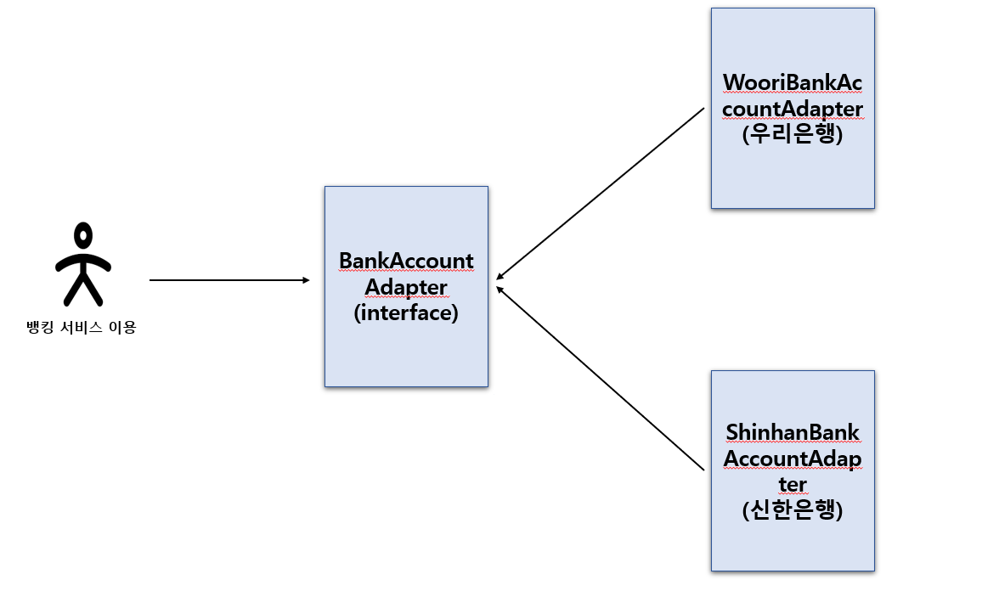

뱅킹 외부 API 호출하는 클라이언트 입장에서는 각각의 모든 은행 모듈을 알고 있다면 만약 특정 은행에 수정이 발생시 클라이언트에서도 영향이 미치게되어 있습니다.

이것은 상위수준 모듈이 하위수준 모듈로 의존해서 발생되는 케이스 인데요. 고수준 (뱅킹 외부 API 호출 하는 클라이언트) 하고 저수준 (각각의 은행 API 모듈) 모두 
추상화에 의존하므로써 특정 은행 모듈 수정되더라도 클라이언트에 영향을 최소 하도록 구성 해보았습니다.


### 은행 서버로 API 통신 하는 과정에서 에러 핸드링 Retry 구현하기

예를들어 각각의 '은행' 서버 에서 특정 API 처리시 갑작스럽게 해당 은행 서버가 갑자기 문제가 발생 했을때 서버가 바로 복구 될때까지
`retry` 통해 이를 문제를 해결하고자 합니다.

단 `retry` 를 하기 위해서는 해당 에러가 재시도를 해도 되는 에러인지 체크를 해야 합니다. 만약 '잔액 부족' 으로 인해 여러번 재시도 해도 동일한 문제가 발생 할 것 입니다.
꼭 재시도를 해도 되는 에러만 체크해서 `retry` 를 해야 합니다.

#### 재시도 할때 고려해야 할 상황들

- 재시도 제한 횟수 (Retry Limited Count)
- 지수 백오프 (Exponential Backoff)
- 지터 (Jitter)

#### 재시도 제한 횟수
재시도 제한 횟수는 말그대로 에러 발생시 재시도를 몇회 다시 시도 할것인가 입니다.

#### 지수 백오프
지수 백오프는 재시도와 재시도 간격은 얼마나 해야할까 입니다. 지수 백오프 사이에 시간 간격이 너무 짧으면 서버 과부하로 이어집니다.
그래서 예시로 1회 재시도시 간격을 1초로 했다면 2회 재시도시에는 간격을 2초로 이렇게 설정 하도록 합니다.

#### jitter
요청이 동시에 재시도 되지 않도록 지수 백오프 (Exponential Backoff) 외에 무작위 지연을 추가적으로 부여하는 것 입니다.


#### Resilience4j Retry 구현
Resilience4j 에서 지원하는 핵심 기능은 많이 있습니다. 대표적으로 CircuitBreaker, Retry 기능이 있습니다. 이 중에서 Retry 기능을 활용 해보고자 합니다.
앞써 이야기 한대로 일시적으로 장애로 인해 은행 관련 API 호출이 실패 되었다면 재시도를 해도 되는지 체크를 한 후 Retry 기능을 활용 해야 합니다.

보통 Retry 기능을 구현하기 위해서는 은행 관련 비지니스 로직에 Retry 관련 로직이 포함 되다는게 문제가 있습니다. 즉 중요한 코드와 중요하지 않은 코드 (Retry 기능을 위한 코드)가 뒤섞여 있으므로 'OCP' 에 준수 하지 않습니다.
Resilience4j Retry 기능 통해 이 문제를 극복 하고자 합니다.

```yaml
resilience4j.retry:
  configs:
    bankRetryConfig:
      maxAttempts: 3
      waitDuration: 1000
      enableExponentialBackoff: true
      exponentialBackoffMultiplier: 5
      retryExceptions:
        - com.wirebarley.global.exception.exception.BankException   # retryExceptions에 지정된 예외는 재시도
        
  instances:
    bankRetryConfig:
      baseConfig: bankRetryConfig
```


## 인증 방식

인증 및 인가 처리 방식은 Spring Security 를 이용해서 구현 했습니다.

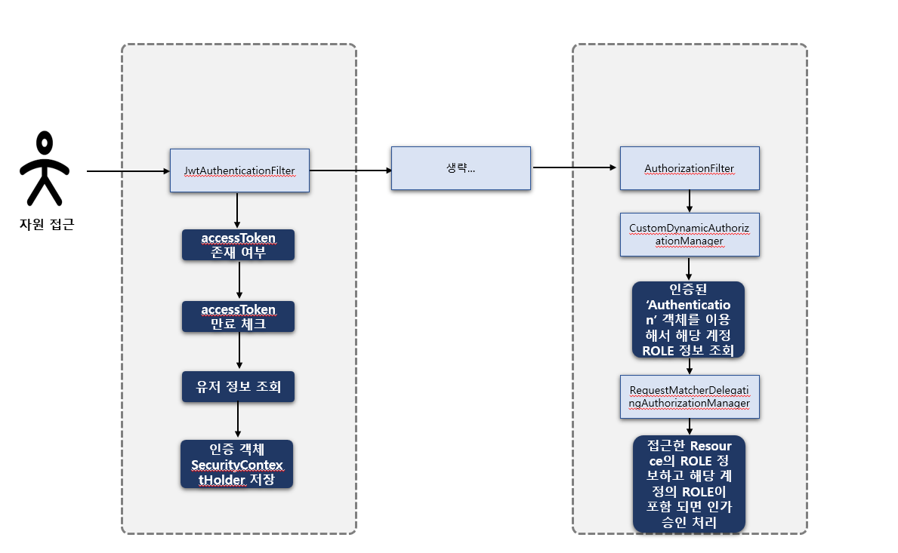


특정 자원에 접근 하면 `JwtAuthenticationFilter` Filter 에서 header 에 `accessToken` 담아서 존재하는지 체크를 해서 해당 토큰 값으로 JWT 유효한지 체크를 합니다.

정상적인 토큰이라면 해당 유저를 DB 에 존재하는지 조회를 합니다.

role 정보 하고 그 외 유저 정보를 가져와서 `authentication` 인증 토큰 값을 만들어서 `SecurityContextHolder` 저장소에 인증 토큰값을 저장을 합니다.

그런 후 해당 리소스 자원값이 해당 유저가 접근 해도 되는지 인가 체크를 합니다.

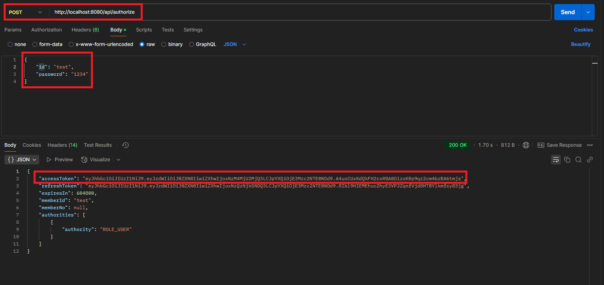

POSTMAN 통해 LOGIN 하는 방법 입니다.

`POST - http://localhost:8080/api/authorize` url 정보를 통해 로그인을 합니다.
요청 body 정보는 `id` - 아이디값, `password` - 패스워드 값을 이용해 인증 해야 합니다.

성공적으로 로그인 절차가 끝나면 `accessToken` 을 발급 받을 수 있습니다.

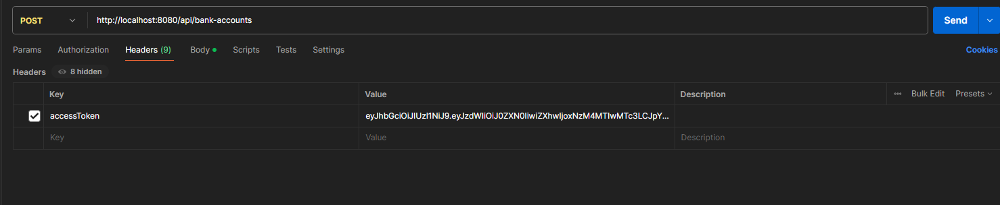

원하는 자원에 접근시 `header` 에 key 값을 `accessToken` 지정하고 value 값을 발급 받았던 accessToken 값을 이용해 지정 하면 됩니다.


## 데이터베이스 설계

https://www.erdcloud.com/d/SZDHKgXoQMFyM7mmB

ERD 구성은 여기서 확인이 가능 합니다. 혹시 접근이 안될 경우 말씀 부탁드립니다. (010-8900-4488 및 syh8088@naver.com)

### 회원 정보 테이블 구성

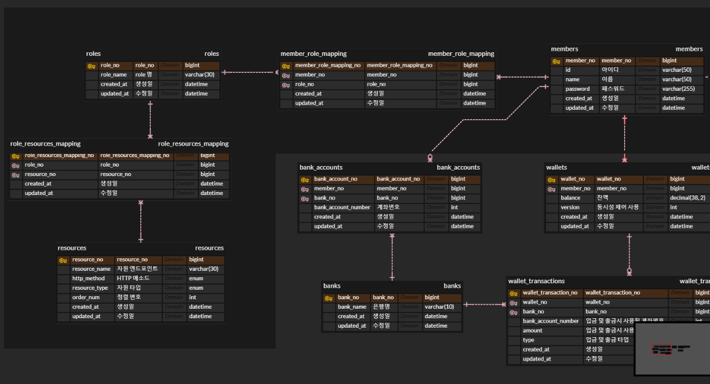

각각의 회원은 어떤 `role` 인지 설정이 가능하도록 구성 되어 있습니다.

여기서 role 구성은 총 4가지로 설정 해보았는데요. 하지만 실질적으로 지금 현재 사용되는 role 은 `ROLE_USER` 밖에 없습니다.

1. ROLE_SUPER_ADMIN
2. ROLE_ADMIN
3. ROLE_CLIENT
4. ROLE_USER

`확장성`, `유연성` 고려하기 위해 `roles` 이라는 테이블을 따로 만들고 `member_role_mapping` 매핑 테이블을 이용해서 특정 `members` 테이블에 존재하는 회원을

role 을 추가하거나 삭제 할 수 있도록 구성 해보았습니다.

`resources` 테이블도 마찬가지 입니다. 특정 자원에 각각의 role 을 가지고 있는 회원들이 접근이 가능한지 인가 처리를 할 수 있도록 테이블 구성 해보았습니다.

`role_resource_mapping` 테이블을 이용해서 `roles` 테이블하고 `resources` 테이블간에 해당 자원은 어느 role 에만 접근 가능한지 추가 및 수정이 가능 하도록 구성 해보았습니다.

정리 하자면 이렇게 `최소한의 중복 데이터만 포함` 하기 위해 각 회원이 role 정보를 구성하기 위해 기존에 role 정보를 수정 하더라도 `members` 테이블은 영향을 미치지 않도록 
`roles`, `role_resource_mapping` 테이블을 만들었습니다.


### 월렛 및 은행 계좌 테이블 구성

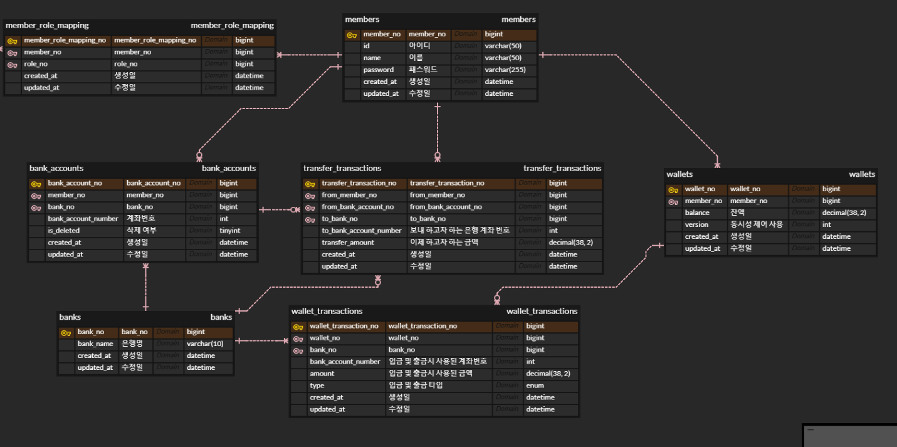

`wallets` 테이블 역활은 해당 회원의 지갑 테이블 입니다. 여기서 총 잔액을 확인 할 수 있고 입금 및 출금 발생 할때 마다 `wallet_transactions` 테이블 통해 입출금 거래 내역을 확인 할 수 있도록 구성 해보았습니다.

각 회원은 어떤 은행 및 계좌를 관리 할 수 있도록 `bank_accounts` 테이블를 만들어 보았습니다. `banks` 테이블은 현재 존재하고 있는 은행 정보를 관리 하도록 되어 있고

각각의 은행 정보를 각 회원이 어떤 은행 정보 및 계좌번호를 관리 하고 있는지 확인 할 수 있는 `bank_accounts` 테이블을 구성 해보았습니다.

앞으로 은행이 추가 되거나 수정 되더라도 `bank_accounts` 테이블은 최소화 하도록 되어 있습니다.

`transfer_transactions` 테이블은 계좌 이체 이력 관리 테이블 입니다.

출금 계좌에서 다른 계좌로 금액을 이체 할때 마다 해당 테이블에서 등록 및 수정이 발생 되도록 되어 있습니다.

### CHAR, VARCHAR 어떤것으로 선택 해야 할까?
`VARCHAR` 데이터 타입 경우 저장되는 문자의 길이 만큼 저장 공간을 할당 하게 되고 그에 반해 
`CHAR` 데이터 타입은 `UTF-8 MB4 문자셋` 과 같은 `가변길이 문자셋` 경우 저장되는 길이 상관 없이 최대 설정된 길이 만큼 항상 공간을 할당 하게 됩니다.

만약에 char(20) 이라고 설정 후 데이터를 저장 시 만약 저장 하는 데이터 바이트가 20이 넘을 경우 빈 공백으로 저장되지 않고 20 바이트 만큼 저장 하게 됩니다.

이것으로 보았을때 `CHAR` 특징은 만약 데이터가 저장 하는 가변 길이 폭이 길어지는 경우 어떤 경우는 공간 낭비가 발생되고 또 어떤 것은 빈 공백 없이 저장 되는 경우가 발생된다는 것을 확인 할 수 있습니다.

하지만 `VARCHAR` 경우 단점이 있는데 저장되는 데이터가 수정일 빈번하게 발생 된다고 했을때 저장된 문자에 대한 기존에 있는 데이터를 삭제 후 빈 공간을 찾아 데이터를 저장 하는 과정이 발생 됩니다.

종합적으로 보았을때 우리 시스템에서는 빈번하게 수정이 발생되지 않고 저장되는 데이터 길이 폭이 길지 않아 `VARCHAR` 로 설정 했습니다.

### 생성일, 수정일 데이터 타입을 DATETIME 및 TIMESTAMP 선택 고려
각각의 장단점이 있습니다. `TIMESTAMP` 경우 `UTC` 로 저장되어 있기 때문에 TIME ZONE 에 따라 저장된 시간을 볼 수 있는데요.

그러기 때문에 상황에 맞춰서 그 TIME ZONE 에 맞는 시간으로 출력이 가능하지만 `DATETIME` 은 수동으로 처리 해야 한다는 단점이 있습니다.

하지만 `TIMESTAMP` 경우는 `2038년 1월 19일` 밖에 저장이 가능해서 `DATETIME` 로 사용하기로 했습니다.


## Sequence Diagram

### 계좌 등록 Sequence Diagram
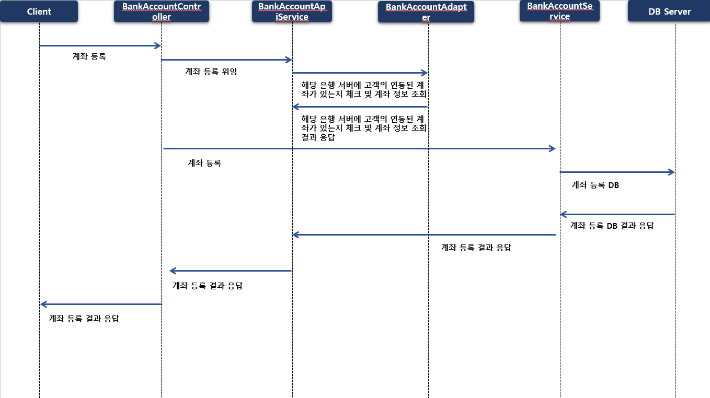

### 입금 Sequence Diagram
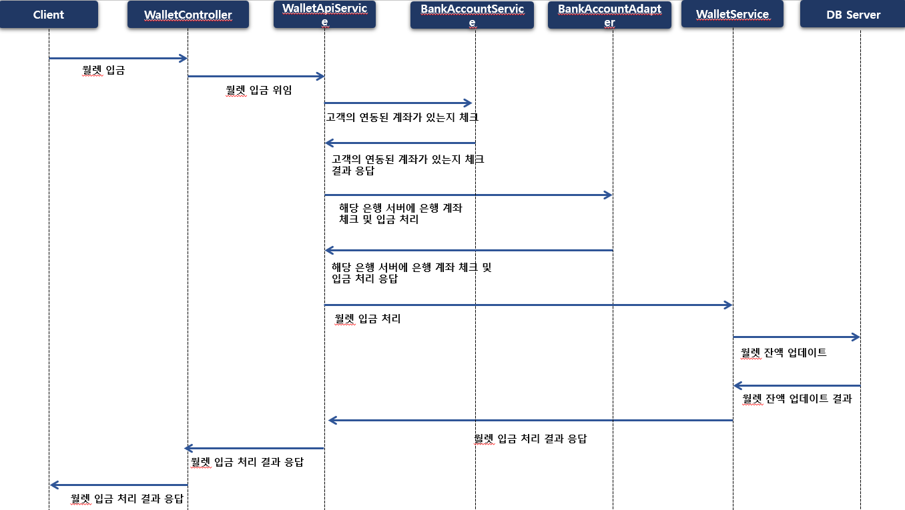

### 출금 Sequence Diagram
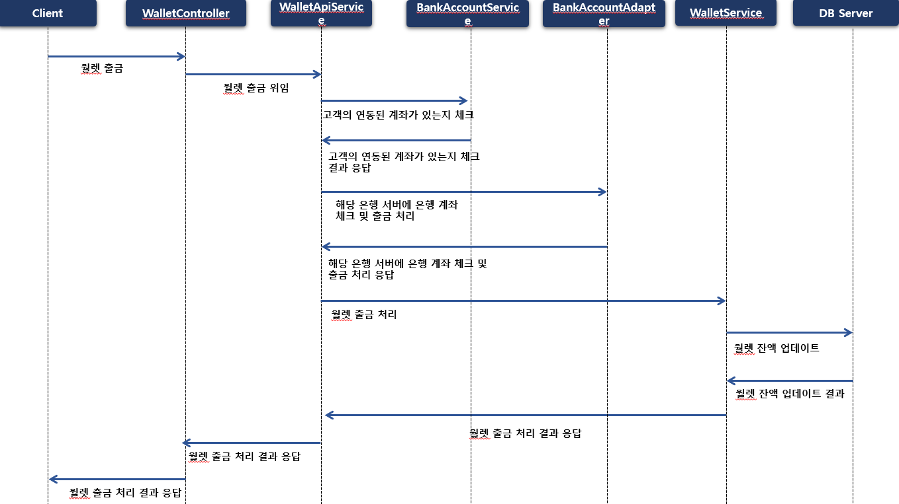

### 계좌 이체 Sequence Diagram
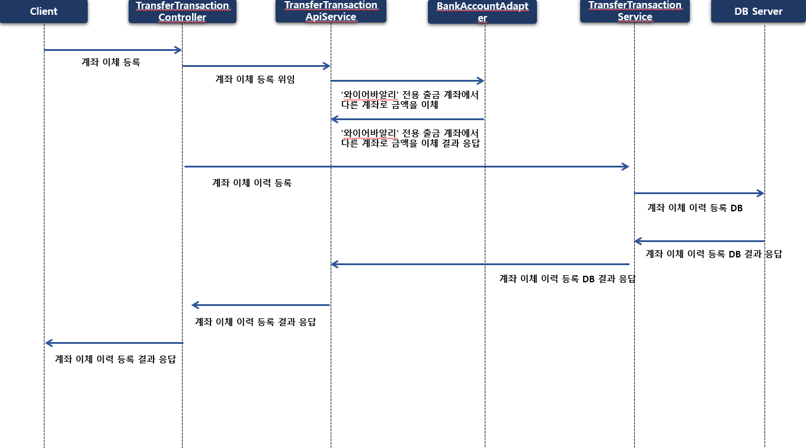